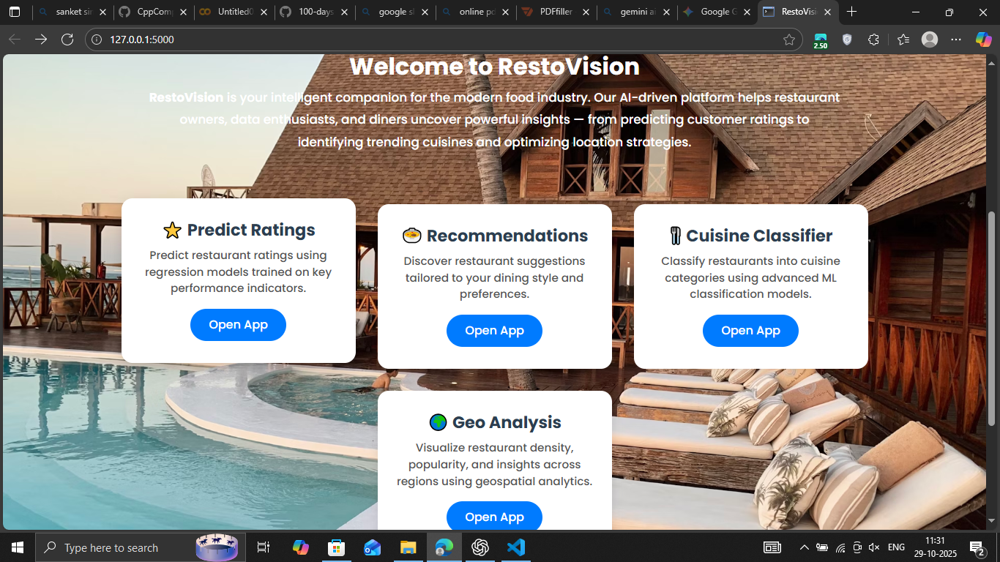
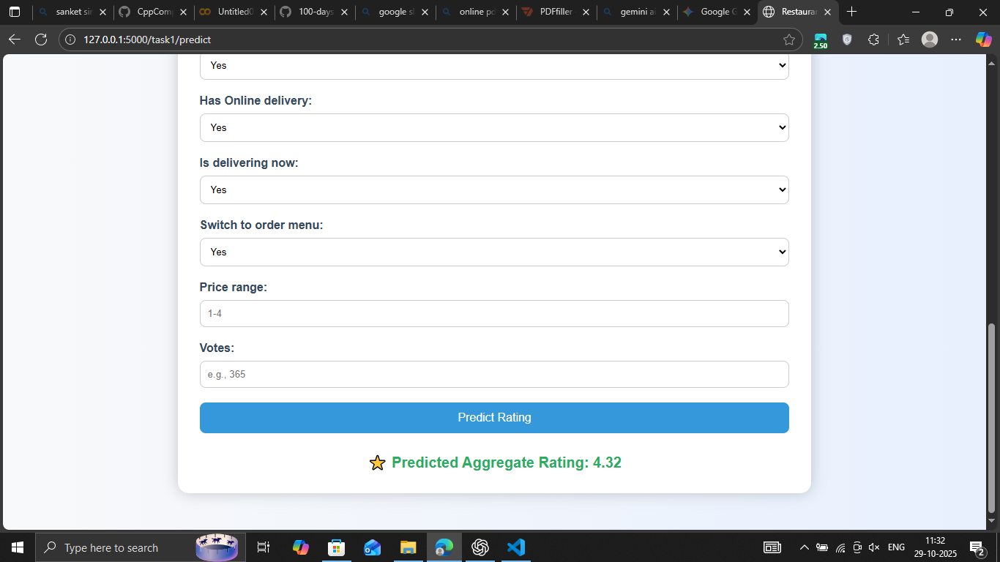
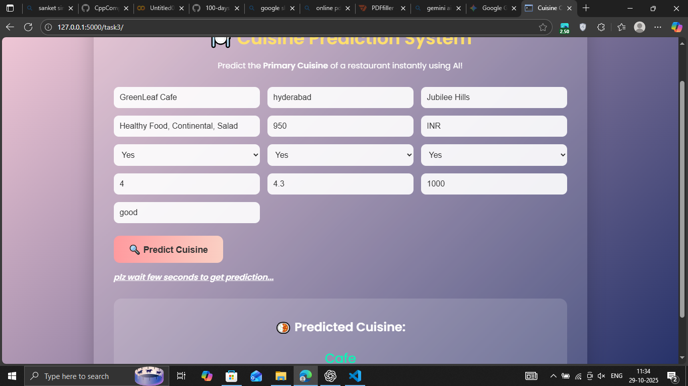
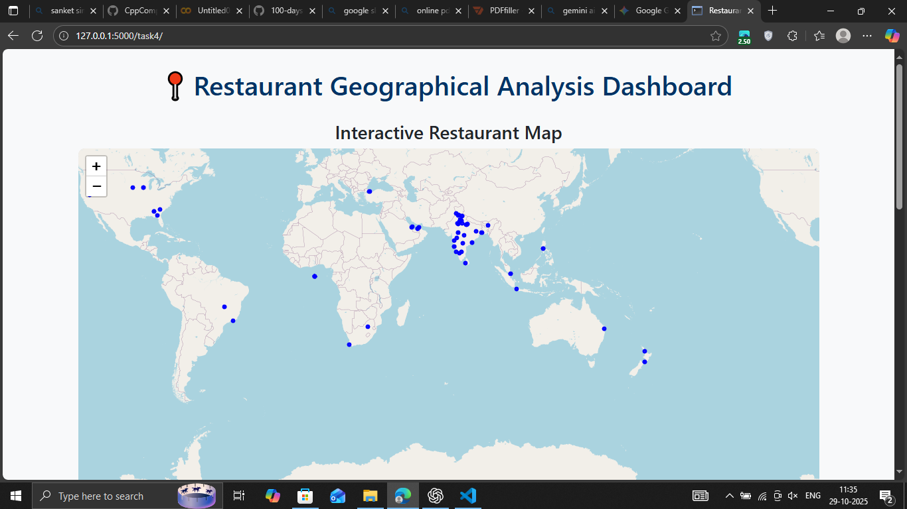

# Restaurant Analytics Multi-Task Application

A comprehensive Flask-based web application for restaurant analytics with four different machine learning tasks.



## Features

### 🍽️ Task 1: Restaurant Rating Prediction

- Predict restaurant aggregate ratings (0-5 scale)
- Uses Random Forest Regressor
- Input: Restaurant details, location, cuisines, price range
- Accuracy: ~96% R² score

### 🔍 Task 2: Restaurant Recommendation System

- Content-based filtering using TF-IDF similarity
- Input: Preferred cuisine, city, price range
- Output: Top 5 recommended restaurants with details

### 🥘 Task 3: Cuisine Classification

- Predict primary cuisine type from restaurant features
- Uses LightGBM Classifier with advanced feature engineering
- Accuracy: ~98%
- Input: Restaurant details, ratings, location, etc.

### 📊 Task 4: Data Visualization & Analytics

- Interactive restaurant location map
- City-wise statistics and rankings
- Rating distributions and analysis
- Top cities by restaurant count and average rating

## Installation

1. Clone the repository:
```bash
git clone https://github.com/vasim/restaurant-analytics-app.git
cd restaurant-analytics-app
```

2. Install dependencies:
```bash
pip install -r requirements.txt
```

3. Run the application:
```bash
python main_app.py
```

4. Open your browser and navigate to: http://127.0.0.1:5000

## Project Structure

```
├── main_app.py                 # Main Flask application
├── requirements.txt            # Python dependencies
├── setup.py                   # Package setup
├── projectflow.txt           # Detailed setup instructions
├── templates/
│   └── home.html             # Home page
├── TASK_1/                   # Rating Prediction Module
│   ├── app.py
│   ├── main.py               # Model training
│   ├── templates/
│   ├── random_forest_model.pkl
│   ├── label_encoders.pkl
│   └── metrics.json
├── TASK_2/                   # Recommendation System
│   ├── app.py
│   ├── main.py
│   ├── templates/
│   ├── restaurant_data.pkl
│   ├── tfidf_vectorizer.pkl
│   └── metrics.json
├── TASK_3/                   # Cuisine Classification
│   ├── app.py
│   ├── main.py
│   ├── templates/
│   ├── static/
│   ├── cuisine_lightgbm_model.joblib
│   └── metrics.json
└── TASK_4/                   # Data Visualization
    ├── app.py
    ├── main.py
    ├── templates/
    ├── static/
    ├── Dataset .csv
    └── metrics.json
```

## Usage

### Web Interface
- **Home**: http://127.0.0.1:5000/
- **Task 1**: http://127.0.0.1:5000/task1/
- **Task 2**: http://127.0.0.1:5000/task2/
- **Task 3**: http://127.0.0.1:5000/task3/
- **Task 4**: http://127.0.0.1:5000/task4/

### API Endpoints
- `POST /task1/predict` - Rating prediction
- `POST /task2/predict` - Restaurant recommendations
- `POST /task3/predict` - Cuisine classification
- `GET /task4/` - Analytics dashboard

## Model Training (Optional)

Pre-trained models are included, but you can retrain them:

```bash
# Task 1
cd TASK_1 && python main.py

# Task 2
cd TASK_2 && python main.py

# Task 3
cd TASK_3 && python main.py

# Task 4
cd TASK_4 && python main.py
```

## Requirements

- Python 3.8+
- Flask
- pandas
- numpy
- scikit-learn
- lightgbm
- matplotlib
- seaborn
- folium
- joblib

## Dataset

The application uses the "Dataset .csv" file containing restaurant data with features like:
- Restaurant details (name, location, cuisines)
- Ratings and reviews
- Price ranges
- Online delivery availability
- Table booking options

## Contributing

1. Fork the repository
2. Create a feature branch
3. Make your changes
4. Submit a pull request

## License

MIT License - see LICENSE file for details.

## Author

**Vasim**

## Acknowledgments

- Dataset source: Restaurant data for analysis
- Built with Flask, scikit-learn, LightGBM, and other ML libraries
- Interactive maps powered by Folium
